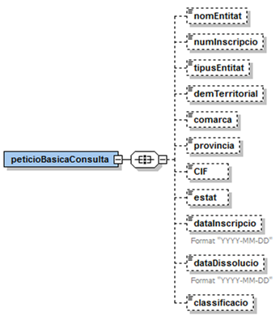
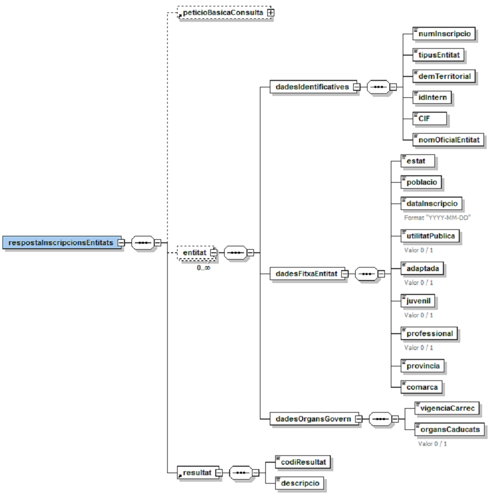
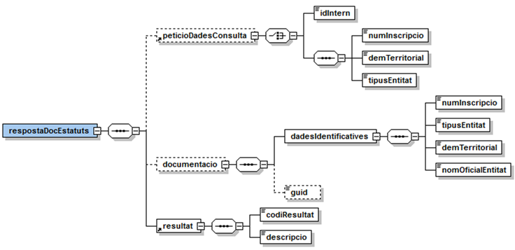
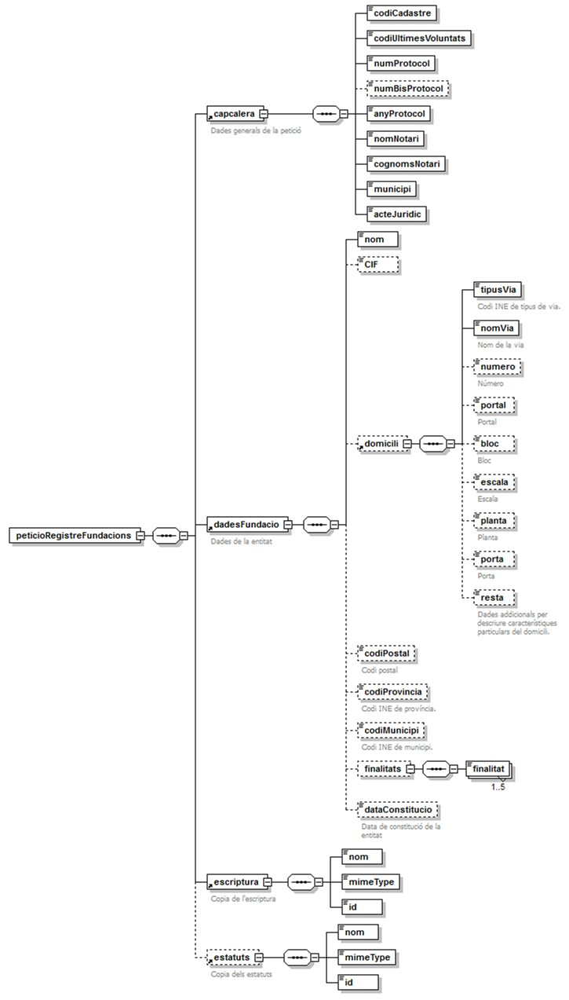
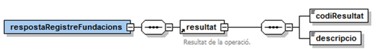
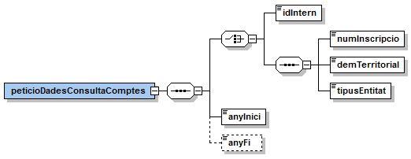
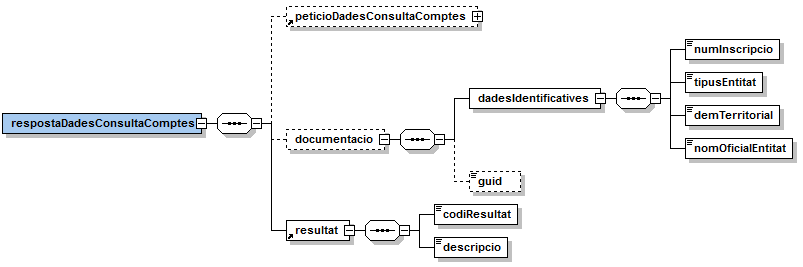

# VO-REG_ENTITATS
Documentació d'integració de la modalitat registre entitats del producte de Via Oberta del Consorci AOC


# 1 Introducció

Aquest document detalla la missatgeria associada al servei del Registre d&#39;Entitats del Departament de Justícia de la Generalitat de Catalunya.

Per a poder realitzar la integració cal conèixer prèviament la següent documentació:

- [Document d&#39;_Especificació de missatgeria pel consum de productes de la plataforma PCI_ del Consorci AOC.](https://github.com/ConsorciAOC/PCI)

# 2 Transmissions de dades disponibles

Les dades disponibles a través del servei són les que es presenten a continuació:

| **EMISSOR** |
| --- |
| Generalitat de Catalunya – Departament de Justícia |

| **PRODUCTE** | **MODALITAT** | **DESCRIPCIÓ** |
|---|---|---|
| **REGISTRE\_ENTITATS** | ENTITAT\_INSCRIPCIO | Consulta de dades bàsiques de les entitats. |
|**REGISTRE\_ENTITATS** | ENTITAT\_DADES | Consulta les dades domiciliàries i òrgans de govern d&#39;una entitat. |
| **REGISTRE\_ENTITATS** | ENTITAT\_ESTATUTS | Obté els estatus d&#39;una entitat amb la documentació corresponent.|
| **REGISTRE\_ENTITATS** | ENTITAT\_COMPTES | Obté els comptes d&#39;una entitat.|
| **REGISTRE\_ENTITATS** |ENTITAT\_ESCRIPTURES¹ | Permet enviar les escriptures públiques cap a la base de dades del Departament de Justícia. |

¹Modalitat de consum exclusiva pel Col·legi de Notaris de Catalunya

---
  Per restriccions de l&#39;emissor de les dades, la modalitat ENTITAT\_ESTATUTS es consumeix exclusivament pel frontal asíncron.

---


Les modalitats ENTITAT\_INSCRIPCIO i ENTITAT\_DADES tenen disponible la versió imprimible del resultat de la consulta en format PDF. Per més detalls adreceu-vos a l&#39;apartat _Extensions de missatgeria_ del document de missatgeria genèrica.

# 3 Missatgeria dels serveis

A continuació es detalla la missatgeria corresponent a les modalitats de consum del producte Registre d&#39;Entitats.

## 3.1 Dades d&#39;inscripció (ENTITAT\_INSCRIPCIO)

Aquesta modalitat permet obtenir una llista d&#39;entitats segons uns criteris genèrics de filtratge. Com a resultat es pot obtenir una llista de fins a 50 entitats.

### 3.1.1 Petició – dades específiques



| _Element_ | _Descripció_ |
| --- | --- |
| /peticioBasicaConsulta/nomEntitat | Nom de l&#39;entitat a consultar. S&#39;admeten noms parcials.|
| /peticioBasicaConsulta/numInscripcio | Número d&#39;inscripció de l&#39;entitat. |
| /peticioBasicaConsulta/tipusEntitat | Tipus de l&#39;entitat. Vegeu l&#39;apartat .|
| /peticioBasicaConsulta/demTerritorial | Demarcació territorial. <li> 1: Barcelona <li>2:Girona <li> 3:Lleida <li> 4:Tarragona <li> 5:Terres de l&#39;Ebre|
| /peticioBasicaConsulta/comarca | Nom de comarca. Vegeu l&#39;apartat 3.1.1.3.|
| /peticioBasicaConsulta/provincia | Nom del província. Vegeu l&#39;apartat 3.1.1.2.|
| /peticioBasicaConsulta/CIF | Codi d&#39;identificació fiscal. |
| /peticioBasicaConsulta/estat | Estat de l&#39;entitat. <li>1: Pendent inscripció <li>2: Inscrita <li>3: Extingida <li> 5: Trasllat<li> 6: Baixa sense inscripció |
| /peticioBasicaConsulta/dataInscripcio | Data d&#39;inscripció (YYYY-MM-DD). |
| /peticioBasicaConsulta/dataDissolucio | Data de dissolució (YYYY-MM-DD). |
| /peticioBasicaConsulta/classificacio | Classificació. Vegeu apartat 3.1.1.2. |

---
 L&#39;emissor final requereix que com a mínim s&#39;informi un dels criteris de filtratge de la petició. La consulta retornarà com a màxim 50 entitats ordenades per data d&#39;inscripció.

---

---
 Hi ha un alt percentatge d&#39;entitats que no tenen el CIF informat a la base de dades del Departament de Justícia. Si a l&#39;hora de fer la consulta informeu el CIF i aquest, tot i ser correcte, no consta a la base de dades de l&#39;emissor, l&#39;entitat no serà localitzada.

--- 

#### 3.1.1.1 Tipus d&#39;entitats

| _Codi tipus_ | _Descripció_ |
| --- | --- |
| 1 | Fundació |
| 10 | Delegació associació |
| 11 | Delegació fundació nacional |
| 12 | Associació estatal |
| 13 | Consell col·legis |
| 14 | Delegació federació |
| 15 | Delegació col·legi |
| 16 | Federació estatal |
| 17 | Patrimonis protegits |
| 2 | Associació |
| 3 | Federació |
| 4 | Col·legi professional |
| 5 | Acadèmia |
| 51 | Notaris i Registradors |
| 6 | Entitat religiosa |
| 7 | Delegació fundació estrangera |
| 73 | Fundació laboral |
| 8 | Altres |
| 9 | Tuteles |

#### 3.1.1.2 Províncies

| _Províncies_ |
| --- |
| Àlaba |
| Albacete |
| Alacant |
| Almeria |
| Àvila |
| Badajoz |
| Balears |
| Barcelona |
| Burgos |
| Càceres |
| Cadis |
| Castelló |
| Ciudad Real |
| Córdoba |
| La Corunya |
| Conca |
| Girona |
| Granada |
| Guadalajara |
| Guipúscoa |
| Huelva |
| Osca |
| Jaén |
| Lleó |
| Lleida |
| La Rioja |
| Lugo |
| Madrid |
| Màlaga |
| Múrcia |
| Navarra |
| Orense |
| Astúries |
| Palència |
| Las Palmas |
| Pontevedra |
| Salamanca |
| Santa Cruz de Tenerife |
| Cantàbria |
| Segòvia |
| Sevilla |
| Sòria |
| Tarragona |
| Terol |
| Toledo |
| València |
| Valladolid |
| Biscaia |
| Zamora |
| Saragossa |
| Ceuta |
| Melilla |

#### 3.1.1.3 Comarques

| _Comarcas_ |
| --- |
| Alt Camp |
| Alt Empordà |
| Alt Penedès |
| Alt Urgell |
| Alta Ribagorça |
| Anoia |
| Bages |
| Baix Camp |
| Baix Ebre |
| Baix Empordà |
| Baix Llobregat |
| Baix Penedès |
| Barcelonès |
| Berguedà |
| Cerdanya |
| Conca de Barberà |
| Garraf |
| Garrigues |
| Garrotxa |
| Gironès |
| Maresme |
| Montsià |
| Noguera |
| Osona |
| Pallars Jussà |
| Pallars Sobirà |
| Pla d&#39;Urgell |
| Pla de l&#39;Estany |
| Priorat |
| Ribera d&#39;Ebre |
| Ripollès |
| Segarra |
| Segrià |
| Selva |
| Solsonès |
| Tarragonès |
| Terra Alta |
| Urgell |
| Vall d&#39;Aran |
| Vallès Occidental |
| Vallès Oriental |

#### 3.1.1.4 Classificació

| _Codi_ | _Classificació_ |
| --- | --- |
| 0 | Sense classificació |
| 2 | Fundació - Assistencial |
| 3 | Fundació - Assistencial i Cultural |
| 4 | Fundació - Assistencial i Docent |
| 5 | Fundació - Assistencial, Docent i Fins Científics |
| 6 | Fundació - Assistencial i Fins Científics |
| 8 | Fundació - Cultural |
| 10 | Fundació - Cultural, Assistencial i Docent |
| 11 | Fundació - Cultural i Docent |
| 12 | Fundació - Cultural, Docent i Fins Científics |
| 13 | Fundació - Cultural i Fins Científics |
| 14 | Fundació - Docent |
| 17 | Fundació - Docent i Fins Científics |
| 18 | Fundació - Fins Científics |
| 31 | Associació - Foment i defensa dels drets cívics, socials i de la persona |
| 32 | Associació - Cultura |
| 33 | Associació - Ensenyament, formació i investigació |
| 34 | Associació - Assistència social |
| 35 | Associació - Salut |
| 36 | Associació - Ordenació de l&#39;espai, ecologia i habitatge |
| 37 | Associació - Interessos de sectors econòmics, geogràfics o professionals |
| 41 | Federació - Foment i defensa dels drets cívics, socials i de la persona |
| 42 | Federació - Cultura |
| 43 | Federació - Ensenyament, formació i investigació |
| 44 | Federació - Assistència Social |
| 45 | Federació - Salut |
| 46 | Federació - Ordenació de l&#39;espai, ecologia i habitatge |
| 47 | Federació - Interessos de sectors econòmics, geogràfics o professionals |
| 50 | Delegació fundació estrangera - Assistencial |
| 51 | Delegació fundació estrangera - Assistencial i Fins Científics |
| 52 | Delegació fundació estrangera - Assistencial i Cultural |
| 53 | Delegació fundació estrangera - Assistencial i Docent |
| 54 | Delegació fundació estrangera - Assistencial, Docent i Fins Científics |
| 55 | Delegació fundació estrangera - Fins Científics |
| 56 | Delegació fundació estrangera - Cultural |
| 57 | Delegació fundació estrangera - Cultural, Assistencial i Docent |
| 58 | Delegació fundació estrangera - Cultural i Fins Científics |
| 59 | Delegació fundació estrangera - Cultural i Docent |
| 60 | Delegació fundació estrangera - Cultural, Docent i Fins Científics |
| 61 | Delegació fundació estrangera - Docent |
| 62 | Delegació fundació estrangera - Docent i Fins Científics |
| 63 | Fundació - Cultural, Assistencial i Fins Científics |
| 64 | Delegació fundació nacional - Assistencial |
| 65 | Delegació fundació nacional - Assistencial i Fins Científics |
| 66 | Delegació fundació nacional - Assistencial i Cultural |
| 67 | Delegació fundació nacional - Assistencial i Docent |
| 68 | Delegació fundació nacional - Assistencial, Docent i Fins Científics |
| 69 | Delegació fundació nacional - Fins Científics |
| 70 | Delegació fundació nacional - Cultural |
| 71 | Delegació fundació nacional - Cultural, Assistencial i Docent |
| 72 | Delegació fundació nacional - Cultural i Fins Científics |
| 73 | Delegació fundació nacional - Cultural i Docent |
| 74 | Delegació fundació nacional - Cultural, Docent i Fins Científics |
| 75 | Delegació fundació nacional - Docent |
| 76 | Delegació fundació nacional - Docent i Fins Científics |
| 84 | Fundació - Assistència, Cultural, Docent i Fins Científics |
| 85 | Fundació - Tutelar |
| 86 | Fundació - Recerca |
| 131 | Associació estatal - Foment i defensa dels drets cívics, socials i de la persona |
| 132 | Associació estatal - Cultura |
| 133 | Associació estatal - Ensenyament, formació i investigació |
| 134 | Associació estatal - Assistència social |
| 135 | Associació estatal - Salut |
| 136 | Associació estatal - Ordenació de l&#39;espai, ecologia i habitatge |
| 137 | Associació estatal - Interessos de sectors econòmics, geogràfics o professionals |
| 231 | Federació estatal - Foment i defensa dels drets cívics, socials i de la persona |
| 232 | Federació estatal - Cultura |
| 233 | Federació estatal - Ensenyament, formació i investigació |
| 234 | Federació estatal - Assistència social |
| 235 | Federació estatal - Salut |
| 236 | Federació estatal - Ordenació de l&#39;espai, ecologia i habitatge |
| 237 | Federació estatal - Interessos de sectors econòmics, geogràfics o professionals |

### 3.1.2 Resposta – dades específiques




| _Element_ | _Descripció_ |
| --- | --- |
| /respostaIncripcionsEntitats/peticioBasicaConsulta | Bloc de dades corresponent a la petició que origina la resposta. |
| /respostaIncripcionsEntitats/entitat | Bloc que conté les dades d&#39;una entitat. Es retornarà fins a un màxim de 50 resultats. |
| //entitat/dadesIdentificatives | Bloc que conté les dades identificatives de l&#39;entitat. |
| //dadesIdentificatives/numInscripcio | Número d&#39;inscripció. |
| //dadesIdentificatives/tipusEntitat | Tipus de l&#39;entitat. Vegeu l&#39;apartat . |
| //dadesIdentificatives/demTerritorial | Demarcació territorial. <li>1: Barcelona <li>2:Girona<li>3:Lleida<li> 4:Tarragona<li>5:Terres de l&#39;Ebre |
| //dadesIdentificatives/idIntern | Identificador intern de l&#39;entitat. |
| //dadesIdentificatives/CIF | Identificador fiscal. |
| //dadesIdentificatives/nomOficialEntitat | Nom de l&#39;entitat. |
| //entitat/dadesFitxaEntitat/estat | Bloc que conté les dades de la fitxa de l&#39;entitat. || //dadesFitxaEntitat/estat | Estat de la inscripció:<li> Pendent inscripció <li>Inscrita<li>Extingida<li>Trasllat<li> Baixa sense inscripció |
| //dadesFitxaEntitat/poblacio | Nom de població on es troba l&#39;entitat. |
| //dadesFitxaEntitat/dataInscripcio | Data d&#39;inscripció (YYYY-MM-DD). |
| //dadesFitxaEntitat/utilitatPublica | Indica si l&#39;entitat compleix una utilitat pública. Els valors possibles són 1 o 0. |
| //dadesFitxaEntitat/adaptada | Indica si l&#39;entitat està adaptada. Els valors possibles són 1 o 0. |
| //dadesFitxaEntitat/juvenil | Indica si l&#39;entitat és juvenil. Els valors possibles són 1 o 0. |
| //dadesFitxaEntitat/professional | Indica si l&#39;entitat és professional. Els valors possibles són 1 o 0. |
| //dadesFitxaEntitat/provincia | Nom de província a la qual es troba l&#39;entitat. |
| //dadesFitxaEntitat/comarca | Nom de comarca a la qual es troba l&#39;entitat. |
| //entitat/dadesOrgansGovern | Bloc que conté les dades referents als òrgans de govern de l&#39;entitat. |
| //dadesOrgansGovern/vigenciaCarrec | Vigència / periodicitat del càrrec (en anys) amb la que s&#39;ha de fer la renovació dels òrgans de govern (p.e. &quot;2a&quot; vol dir que segons els estatuts de l&#39;entitat cal renovar l&#39;òrgan de govern cada dos anys). |
| //dadesOrgansGovern/organsCaducats | Indica si la els òrgans de govern de l&#39;entitat es troben caducats. Els valors possibles són 1 o 0. |
| /respostaIncripcionsEntitats/resultat/codiResultat |<li>0: consulta realitzada correctament.<li> 1: error realitzant la consulta. |
| /respostaIncripcionsEntitats/resultat/descripcio | Literal descriptiu del resultat de la consulta. |

## 3.2 Dades completes d&#39;una entitat (ENTITAT\_DADES)

Aquesta modalitat permet consultar les dades domiciliàries i els òrgans de govern de les entitats obtingudes amb la modalitat *ENTITAT\_INSCRIPCIO*.

La consulta es pot realitzar informant l&#39;identificador intern obtingut mitjançant una crida a la modalitat *ENTITAT\_INSCRIPCIO* o bé informant el seu número d&#39;inscripció, la demarcació territorial i el tipus d&#39;entitat.

La llista de càrrecs pot incloure dades de persones físiques i de persones jurídiques.

### 3.2.1 Petició – dades específiques


| _Element_ | _Descripció_ |
| --- | --- |
| /peticioDadesConsulta/idIntern | Identificador intern, retornat en la resposta de la modalitat *ENTITAT\_INSCRIPCIO*.<br> L&#39;ús d&#39;aquest paràmetre exclou l&#39;ús dels tres següents. |
| /peticioDadesConsulta/numInscripcio | Número d&#39;inscripció de l&#39;entitat.|
| /peticioDadesConsulta/demTerritorial | Codi de demarcació territorial a la que pertany l&#39;entitat, retornat en la resposta de la modalitat *ENTITAT\_INSCRIPCIO*:<li> 1: Barcelona<li> 2:Girona<li>3:Lleida<li> 4:Tarragona<li> 5:Terres de l&#39;Ebre |
| /peticioDadesConsulta/tipusEntitat | Tipus de l&#39;entitat. Vegeu l&#39;partat 0 . |

### 3.2.2 Resposta – dades específiques

| _Element_ | _Descripció_ |
| --- | --- |
| /respostaDadesEntitat/peticioDadesConsulta | Bloc de dades corresponent a la petició que origina la resposta. |
| /respostaDadesEntitat/entitat | Bloc que conté les dades de la entitat. |
| //entitat/dadesIdentificatives | Bloc que conté les dades identificatives de la entitat. |
| //dadesIdentificatives/numInscripcio | Número d&#39;inscripció de l&#39;entitat. |
| //dadesIdentificatives/tipusEntitat | Tipus de l&#39;entitat. Vegeu l&#39;apartat . |
| //dadesIdentificatives/demTerritorial | Demarcació territorial.<li>1: Barcelona<li> 2:Girona<li> 3:Lleida<li>4:Tarragona<li>5:Terres de l&#39;Ebre |
| //dadesIdentificatives/nomOficialEntitat | Nom oficial de l&#39;entitat. |
| //entitat/organGovern | Bloc que conté les dades dels òrgans de govern. |
| //organGovern/carrec | Càrrec de l&#39;òrgan de l&#39;entitat. |
| //organGovern/dataInscripcio | Data d&#39;inscripció (*YYYY-MM-DD*). |
| //organGovern/dataPrevistaBaixa | Data prevista de baixa (*YYYY-MM-DD*). |
| //organGovern/dataBaixa | Data de baixa (*YYYY-MM-DD*). |
| //organGovern/vitalici | Indica si l&#39;òrgan és vitalici. Els valors possibles són 1 o 0. |
| //organGovern/natural | Indica si l&#39;òrgan és natural. Els valors possibles són 1 o 0. |
| //organGovern/personaFisica | Bloc que conté les dades de la persona física associada a l&#39;òrgan de govern. L&#39;ús d&#39;aquest bloc exclou l&#39;ús del bloc personaJuridica. |
| //personaFisica/nom | Nom de la persona física. |
| //personaFisica/primerCognom | Primer cognom de la persona física. |
| //personaFisica/segonCognom | Segon cognom de la persona física. |
| //organGovern/personaJuridica | Bloc que conté les dades de la persona jurídica associada a l&#39;òrgan de govern. L&#39;ús d&#39;aquest bloc exclou l&#39;ús del bloc personaFisica. |
| //personaJuridica/denominacio | Denominació de la persona jurídica. |
| //personaJuridica/CIF | Identificador fiscal de la persona jurídica. |
| //entitat/dadesDomiciliaries | Bloc que conté les dades domiciliàries de l&#39;entitat. |
| //dadesDomiciliaries/tipusVia | Tipus de via. |
| //dadesDomiciliaries/nomVia | Via. |
| //dadesDomiciliaries/numero | Número. |
| //dadesDomiciliaries/bloc | Bloc. |
| //dadesDomiciliaries/escala | Escala. |
| //dadesDomiciliaries/pis | Pis. |
| //dadesDomiciliaries/porta | Porta. |
| //dadesDomiciliaries/telefon | Telèfon. |
| //dadesDomiciliaries/fax | Fax. |
| //dadesDomiciliaries/restaDomicili | Dades addicionals que es vulgui aportar en referència al domicili de l&#39;entitat. |
| //dadesDomiciliaries/codiPostal | Codi postal. |
| //dadesDomiciliaries/comarca | Nom de comarca. |
| //dadesDomiciliaries/provincia | Nom de província. |
| //dadesDomiciliaries/codiPoblacio | Població (INE). |
| //dadesDomiciliaries/nomPoblacio | Nom de població. |
| //dadesDomiciliaries/municipiForaCatalunya | Municipi fora de Catalunya (0: no fora | 1: fora).|
| //dadesDomiciliaries/pais | Nom de país. |
| /respostaDadesEntitat/resultat/codiResultat |<li> 0: consulta realitzada correctament.<li> 1: error realitzant la consulta.<li> 2: no s&#39;han trobat entitats. |
| /respostaDadesEntitat/resultat/descripcio | Literal descriptiu del resultat de la consulta. |


#### 3.2.2.1 Càrrec

| _Codi_ | _Càrrec_ |
| --- | --- |
| 1 | President d&#39;honor |
| 2 | President |
| 3 | President adjunt |
| 4 | Copresident |
| 5 | Vicepresident |
| 6 | Administrador |
| 8 | Secretari general |
| 9 | Secretari |
| 11 | Vicesecretari |
| 12 | Secretari no patró |
| 13 | Director |
| 14 | Interventor |
| 15 | Tresorer |
| 16 | Vicetresorer |
| 17 | Vocal |
| 18 | Comptador |
| 20 | Censor |
| 21 | Conciliari |
| 22 | Degà |
| 24 | Altres |
| 25 | Bibliotecari |
| 26 | Vicesecretari no patró |
| 28 | Vocal 1r |
| 29 | Vocal 2n |
| 30 | Vocal 3r |
| 31 | Vocal 4t |
| 32 | Vocal 5è |
| 33 | Vocal 6è |
| 34 | Vocal 7è |
| 35 | Vocal 8è |
| 36 | Vicepresident d&#39;honor |
| 37 | Vicepresident 1r |
| 38 | Vicepresident 2n |
| 39 | Patró |
| 40 | Gerent |
| 41 | Mandatari |
| 43 | Presidenta |
| 44 | Secretària |
| 45 | Tresorera |
| 46 | Advocat |
| 47 | Secretari-Tresorer |
| 48 | Delegat |
| 49 | Tresorer no patró |
| 50 | Secretari 1r |
| 51 | Secretari 2n |
| 52 | Secretària adjunta |
| 53 | Tresorera adjunta |
| 56 | Vicepresident 3r |
| 57 | President executiu |
| 100 | Sotspresident |
| 101 | Vicepresident-Tresorer |
| 107 | Comptador-Tresorer |
| 108 | Coordinador |
| 128 | Vicedegà |
| 131 | Vicedegana |
| 134 | Bibliotecària |
| 135 | Degana |
| 140 | Comptadora |
| 141 | Vicesecretària |
| 143 | Conseller |
| 144 | Presidenta executiva |
| 145 | Sotspresidenta |
| 146 | Vicepresidenta d&#39;honor |
| 147 | Vicepresidenta |
| 148 | Vicepresidenta 1a |
| 149 | Vicepresidenta 2a |
| 150 | Vicepresidenta 3a |
| 151 | Vicepresidenta-Tresorera |
| 152 | Administradora |
| 153 | Secretària 1a |
| 154 | Secretària 2a |
| 155 | Secretària-Tresorera |
| 156 | Directora |
| 157 | Secretari adjunt |
| 158 | Tresorer adjunt |
| 159 | Vicetresorera |
| 162 | Comptadora-Tresorera |
| 163 | Presidenta d&#39;honor |
| 164 | Presidenta adjunta |
| 166 | Secretària general |
| 167 | Vicesecretària general |
| 168 | Patrona |
| 169 | Vocal 9è |
| 170 | Vocal 10è |
| 171 | Vocal 11è |
| 172 | Vocal 12è |
| 173 | Vocal 13è |
| 174 | Vocal 14è |
| 175 | Vocal 15è |
| 176 | Vocal 16è |
| 177 | Vocal 17è |
| 178 | Vocal 18è |
| 179 | Vocal 19è |
| 180 | Vocal 20è |
| 181 | Mandatària |
| 182 | Advocada |
| 183 | Secretària no patrona |
| 184 | Vicesecretària no patrona |
| 187 | Tresorera no patrona |
| 188 | Copresidenta |
| 189 | Interventora |
| 201 | Sotsdegà |
| 208 | Viceconciliari |
| 252 | Arxivera |
| 271 | Sotspresident 1r |
| 272 | Sotspresident 2n |
| 273 | Sotspresident 3r |
| 321 | Degà-President |
| 325 | Tresorer-Comptador |
| 336 | Tresorer Comptador |
| 349 | Vicedegà 1r |
| 350 | Vicedegà 2n |
| 354 | Degana-Presidenta |
| 373 | Vicepresident 4t |
| 411 | Arxiver |
| 417 | Sotspresidenta 1a |
| 418 | Sotspresidenta 2a |
| 439 | President 1r |
| 440 | President 2n |
| 441 | Vicepresident 5è |
| 442 | Sotssecretari |
| 443 | Vocal Tresorer |
| 445 | Secretari Administrador |
| 459 | Consellera |
| 460 | Coordinadora |
| 461 | Delegada |

## 3.3 Obtenció dels estatuts (ENTITAT\_ESTATUTS)

Aquesta modalitat permet obtenir els documents dels estatuts d&#39;una entitat:

---

 Aquesta modalitat es serveix exclusivament pel frontal asíncron.

---

### 3.3.1 Petició – dades específiques


| _Element_ | _Descripció_ |
| --- | --- |
| /peticioDadesConsulta/idIntern | Identificador intern (retornat per la modalitat ENTITAT\_INSCRIPCIO). |
| /peticioDadesConsulta/numIncripcio | Número d&#39;inscripció de l&#39;entitat. |
| /peticioDadesConsulta/demTerritorial | Codi de demarcació territorial on pertany l&#39;entitat (retornat per la modalitat ENTITAT\_INSCRIPCIO):<li> 1: Barcelona<li> 2:Girona<li> 3:Lleida<li> 4:Tarragona<li>5:Terres de l&#39;Ebre |
| /peticioDadesConsulta/tipusEntitat | Tipus de l&#39;entitat. Vegeu l&#39;apartat . |

### 3.3.2 Resposta – dades específiques

| _Element_ | _Descripció_ |
| --- | --- |
| /respostaDocEstatuts/peticioDadesConsulta | Bloc de dades corresponent a la petició que origina la resposta. |
| /respostaDocEstatuts/documentacio | Bloc que conté els documents. |
| //documentacio/dadesIdentificatives | Bloc que conté les dades identificatives de l&#39;entitat. |
| //dadesIdentificatives/numInscripcio | Número d&#39;inscripció. |
| //dadesIdentificatives/tipusEntitat | Tipus de l&#39;entitat:<li>1: Fundació<li>2: Associació<li> 3: Federació<li> 4: Associació Juvenil |
| //dadesIdentificatives/demTerritorial | Demarcació territorial.<li> 1: Barcelona<li> 2:Girona<li> 3:Lleida<li> 4:Tarragona<li>5:Terres de l&#39;Ebre |
| //dadesIdentificatives/nomOficialEntitat | Nom oficial de l&#39;entitat. |
| //documentacio/guid | GUID del document que permet la descàrrega via URL de descàrrega __²__ (per descarregar documents pesats els quals no es poden incrustar en el XML de resposta) .<br><br> Tots els documents es lliuraran en un únic fitxer ZIP comprimit. |
| /respostaDocEstatuts /resultat/codiResultat |<li> 0: consulta realitzada correctament.<li> 1: error realitzant la consulta.<li> 2: no s&#39;han trobat entitats.|
| /respostaDocEstatuts /resultat/descripcio | Literal descriptiu del resultat de la consulta. |

__²__ URL de descàrrega a producció: 
```
https://serveis3.iop.aoc.cat/CAOC-PCI30-MC-REGISTREENTITATS/descarrega?guid=<GUID>
```



## 3.4 Lliurament d&#39;escriptures (ENTITAT\_ESCRIPTURES)

Aquesta modalitat permet lliurar escriptures públiques i incorporar-les a la base de dades del Departament de Justícia:

---
 Aquesta modalitat es serveix exclusivament pel frontal asíncron.

---


### 3.4.1 Petició – dades genèriques

Els fitxers a transferir s&#39;han de referenciar al bloc de dades *//Ficheros/Fichero* de les dades genèriques de la sol·licitud.

| _Element_ | _Descripció_ |
| --- | --- |
| //Ficheros/Fichero/Contenido | Contingut del fitxer en cas de transferència per MTOM (en la crida correspon a la referència XOP del fitxer). |
| //Ficheros/Fichero/RutaFichero | Alternativa a *Contenido*, permet informa la ruta (ha de ser accessible per la plataforma PCI del CAOC) on es troba el fitxer (p.e. transferint-la prèviament per SFTP). |
| //Ficheros/Fichero/Id | Identificador del fitxer referenciat a les dades específiques:<li> *//escriptura/id*<li> *//estatuts/id* |

### 3.4.2 Petició – dades específiques

| _Element_ | _Descripció_ |
| --- | --- |
| /peticioRegistreFundacions/capcalera | Bloc que conté les dades generals de la petició. |
| //capcalera/codiCadastre | Codi de cadastre. |
| //capcalera/codiUltimesVoluntats | Codi d&#39;últimes voluntats. |
| //capcalera/numProtocol | Número de protocol. |
| //capcalera/numBisProtocol | Número bis de protocol. |
| //capcalera/anyProtocol | Any de protocol. |
| //capcalera/nomNotari | Nom del notari. |
| //capcalera/cognomsNotari | Cognoms del notari. |
| //capcalera/municipi | Municipi. |
| //capcalera/acteJuridic | Acte jurídic. |
| /peticioRegistreFundacions/dadesFundacio | Bloc que conté les dades de la fundació. |
| //dadesFundacio/nom | Nom. |
| //dadesFundacio/CIF | Identificador fiscal. |
| //dadesFundacio/domicili | Bloc que conté les dades domiciliàries de la fundació. |
| //domicili/tipusVia | Tipus de via. |
| //domicili/nomVia | Nom de la via. |
| //domicili/numero | Número. |
| //domicili/portal | Portal. |
| //domicili/bloc | Bloc. |
| //domicili/escala | Escala. |
| //domicili/planta | Planta. |
| //domicili/porta | Porta. |
| //domicili/resta | Dades addicionals que es vulguin fer constar per al domicili. |
| //dadesFundacio/codiPostal | Codi postal. |
| //dadesFundacio/codiProvincia | Codi INE de província (vegeu *CODIS\_TERRITORIALS\_PROVINCIES.xls*). |
| //dadesFundacio/codiMunicipi | Codi INE de municipi (vegeu *CODIS\_TERRITORIALS\_MUNICIPI.xls*). |
| //dadesFundacio/finalitats | Bloc que conté les dades de les finalitats de la fundació. |
| //finalitats/finalitat | Finalitat. |
| //dadesFundacio/dataConstitucio | Data de constitució de la fundació (YYYY-MM-DD). |
| /peticioRegistreFundacions/escriptura | Bloc que conté les escriptures. |
| //escriptura/nom | Nom. |
| //escriptura/mimeType | Tipus del document:<li> *XML*<li> *PDF*<li> *RTF*<li>*DOC*<li> *UNKNOWN* |
| //escriptura/id | Identificador de fitxer. Únic en la petició.<br><br> Per identificar el fitxer corresponent al formulari de tramitació, caldrà alinear l&#39;atribut *Fichero@Id* del bloc genèric amb l&#39;element *id* de les dades específiques de la sol·licitud (vegeu apartat 3.4.1). |
| /peticioRegistreFundacions/estatuts | Bloc que conté els estatuts. |
| //estatuts/nom | Nom. |
| //estatuts/mimeType | Tipus del document:<li> *XML*<li> *PDF*<li> *RTF*<li> *DOC*<li> *UNKNOWN* |
| //estatuts/id | Identificador de fitxer. Únic en la petició.<br><br> Per identificar el fitxer corresponent al formulari de tramitació, caldrà alinear l&#39;atribut *Fichero@Id* del bloc genèric amb l&#39;element *id* de les dades específiques de la sol·licitud (vegeu apartat 3.4.1).|




### 3.4.3 Resposta – dades específiques

| _Element_ | _Descripció_ |
| --- | --- |
| /respostaRegistreFundacions/resultat/codiResultat |<LI>0: operació realitzada correctament.<li> 1: error realitzant l&#39;operació.<li> 2: no s&#39;han trobat entitat. |
| /respostaRegistreFundacions/resultat/descripcio | Literal descriptiu del resultat de la consulta.|



## 3.5 Obtenció dels compte (ENTITAT\_COMPTES)

Aquesta modalitat permet obtenir els documents dels estatuts d&#39;una entitat:

---

 Aquesta modalitat es serveix exclusivament pel frontal asíncron.

---

### 3.5.1 Petició – dades específiques



| _Element_ | _Descripció_ |
| --- | --- |
| /peticioDadesConsultaComptes/idIntern | Identificador intern (retornat per la modalitat *ENTITAT\_INSCRIPCIO*). |
| /peticioDadesConsultaComptes/numIncripcio | Número d&#39;inscripció de l&#39;entitat. |
| /peticioDadesConsultaComptes/demTerritorial | Codi de demarcació territorial on pertany l&#39;entitat (retornat per la modalitat *ENTITAT\_INSCRIPCIO*):<li>1: Barcelona<li> 2:Girona<li> 3:Lleida<li>4:Tarragona<li> 5:Terres de l&#39;Ebre |
| /peticioDadesConsultaComptes/tipusEntitat | Tipus de l&#39;entitat. Vegeu l&#39;apartat . |
| /peticioDadesConsultaComptes/anyInici | Exercici dels comptes (no s&#39;ha d&#39;entendre com un interval d&#39;anys). En casos on l&#39;exercici comença un cop entrat l&#39;any es pot especificar l&#39;inici i fi (p.e. una entitat per la qual l&#39;exercici econòmic va des del l&#39;1 de setembre al 31 d&#39;agost s&#39;informaria *anyInici=2011* i *anyFi=2012* tot i que l&#39;emissor indica que informant únicament l&#39;inici és suficient). |
| /peticioDadesConsultaComptes/anyFi |

### 3.5.2 Resposta – dades específiques

| _Element_ | _Descripció_ |
| --- | --- |
| /respostaDadesConsultaComptes/peticioDadesConsultaComptes | Bloc de dades corresponent a la petició que origina la resposta.|
| /respostaDadesConsultaComptes/documentacio | Bloc que conté els documents. |
| //documentacio/dadesIdentificatives | Bloc que conté les dades identificatives de l&#39;entitat. |
| //dadesIdentificatives/numInscripcio | Número d&#39;inscripció. |
| //dadesIdentificatives/tipusEntitat | Tipus de l&#39;entitat:<li> 1: Fundació<li> 2: Associació<li> 3: Federació<li> 4: Associació Juvenil |
| //dadesIdentificatives/demTerritorial | Demarcació territorial.<li> 1: Barcelona<li> 2:Girona<li> 3:Lleida<li> 4:Tarragona<li> 5:Terres de l&#39;Ebre |
| //dadesIdentificatives/nomOficialEntitat | Nom oficial de l&#39;entitat. |
| //documentacio/guid | GUID del document que permet la descàrrega via URL de descàrrega __³__  (per descarregar documents pesats els quals no es poden incrustar en el XML de resposta) .<br><br> Tots els documents es lliuraran en un únic fitxer ZIP comprimit. |
| /respostaDocEstatuts /resultat/codiResultat |<li>0: consulta realitzada correctament.<li> 1: error realitzant la consulta.<li> 2: no s&#39;han trobat entitats. |
| /respostaDocEstatuts /resultat/descripcio | Literal descriptiu del resultat de la consulta. |



 __³__ URL de descàrrega a producció:
```
https://serveis3.iop.aoc.cat/CAOC-PCI30-MC-REGISTREENTITATS/descarrega?guid=<GUID>
```